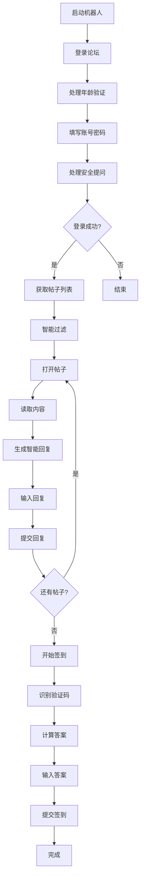

<div align="center">

# 🌸 色花堂智能助手 Pro

<p align="center">
  <strong>色花堂论坛专用智能自动化系统</strong>
</p>

<p align="center">
  
  
  
  
  
</p>

<p align="center">
  智能回复 · 自动签到 · 验证码识别 · 定时任务 · Web控制面板
</p>

</div>

---

## 🔥 最新更新（v3.7）

### 🎯 Cron调度与Commit版本号（v3.7 - 2025-10-27）
- **⏰ Cron表达式支持** - 支持标准5字段Cron表达式，灵活配置调度规则
- **🔧 三种调度模式** - Cron模式、固定时间点、单一时间，满足不同需求
- **📦 版本号优化** - 改用Git Commit Hash，精确追踪代码版本
- **🔄 完全向下兼容** - 旧配置自动适配，无需手动迁移
- **📚 详细文档** - 新增Cron使用指南和版本号指南

### 📜 历史版本
- **v3.6**: 自动重试与多次调度（成功率提升至99%）
- **v3.5**: 在线更新与版本管理（全面升级）
- **v3.4**: 智能回复库大幅扩充（1000+条色情短语）
- **v3.3**: 仪表盘优化 + Docker自动更新优化
- **v3.2**: Web界面全面重构，响应式设计
- **v3.1**: 登录状态保存，避免频繁登录被封号

---

## ✨ 核心特性

### 🧠 智能回复系统
- **1000+ 色情语句库** - 根据帖子内容动态生成回复（v3.4大幅扩充）
- **多维度特征识别** - 自动识别紧致、巨乳、美腿、嫩、无码等特征
- **每类特征100条回复** - 确保回复多样性，降低重复率
- **明星名字提取** - 自动识别并引用明星/女优名字
- **AI换脸识别** - 专门针对AI换脸内容的回复
- **极低重复率** - 即使回复30个帖子也很少重复

### 🎯 自动化功能
- **自动登录** - 处理账号、密码、安全提问、年龄验证
- **登录状态保存** - 一次登录，长期使用，避免反复登录被封号 ⭐
- **自动回复** - 智能生成色情回复并提交
- **自动签到** - 数学验证码自动识别计算
- **帖子去重** - 同ID帖子只处理一次
- **智能过滤** - 自动跳过公告、通知、规则等帖子

### 🧪 测试系统
- **签到测试** - 验证签到流程但不实际点击
- **回复测试** - 打开帖子、输入回复但不发送
- **完整流程预览** - 可视化验证所有步骤

### 🌐 Web控制面板（全新设计）
- **响应式界面** - 完美适配手机、平板、电脑，随时随地管理
- **左侧菜单栏** - 专业的导航体验，五大功能模块
- **仪表盘** - 实时监控运行状态、回复统计、签到情况
- **回复记录** - 查看所有历史回复（1000条），卡片式布局
- **运行日志** - 500条实时日志，彩色显示，可自由翻阅
- **系统配置** - 在线修改所有参数，无需编辑文件
- **系统更新** - Web界面一键更新（ZIP方式），自动重启并刷新 ⭐升级
- **版本信息** - 侧边栏显示当前/最新版本，自动静默检查 ⭐新增
- **远程控制** - 一键启动/停止机器人
- **登录验证** - 账号密码保护，支持环境变量

### ⏰ 定时任务（v3.7 增强）
- **Cron表达式支持** - 支持标准5字段Cron表达式，灵活配置复杂调度规则 ⭐v3.7新增
- **三种调度模式** - Cron模式/固定时间点/单一时间，满足不同需求 ⭐v3.7新增
- **多时间点调度** - 每天可设置4个时间点（凌晨3点、上午9点、下午3点、晚上9点）⭐v3.6
- **自动重试机制** - 失败后自动重试3次，间隔5分钟 ⭐v3.6
- **智能跳过** - 检测到今天已签到成功后自动跳过 ⭐v3.6
- **签到状态记录** - 自动记录每日签到时间 ⭐v3.6
- **内置集成** - 与Web服务集成，无需单独容器
- **完全向下兼容** - 自动适配旧配置格式

---

## 📂 项目结构

```
色花堂智能助手 Pro/
├── 📄 核心程序
│   ├── selenium_auto_bot.py     # 核心机器人程序
│   ├── web_app.py               # Web控制面板（集成定时任务）
│   ├── scheduler.py             # 独立定时任务程序
│   ├── config.json              # 配置文件
│   └── requirements.txt         # Python依赖
│
├── 📂 scripts/ - 启动脚本
│   ├── start.bat / start.sh                 # 直接运行
│   ├── start_web.bat / start_web.sh         # Web控制面板
│   └── start_scheduler.bat / start_scheduler.sh  # 定时任务
│
├── 📂 templates/ - Web界面
│   ├── index.html              # 主控制面板
│   └── login.html              # 登录页面
│
├── 📂 docs/ - 文档
│   ├── README_WEB.md           # Web使用指南
│   ├── README_SCHEDULER.md     # 定时任务指南
│   └── 配置说明.md             # 配置详解
│
├── 📂 logs/ - 日志（自动生成）
│   ├── selenium_bot.log
│   └── scheduler.log
│
├── 📂 debug/ - 调试文件（自动生成）
│   ├── login_failed.png
│   ├── login_page_debug.html
│   └── reply_page_debug.html
│
└── 🐳 Docker部署
    ├── Dockerfile
    ├── docker-compose.yml
    ├── docker-start.bat / docker-start.sh
    └── README_DOCKER.md
```

---

## 🚀 快速开始

### 方式A：Docker Compose 部署（推荐⭐）

#### 1️⃣ 准备配置文件

```bash
# 创建数据目录
mkdir -p AW98tang/logs AW98tang/debug AW98tang/data

# 复制并编辑配置文件
cp config.json.example AW98tang/config.json
# 编辑 AW98tang/config.json，填写论坛账号密码
```

#### 2️⃣ docker-compose.yml 配置

```yaml
version: '3.8'

services:
  AW98tang:
    # 使用 Docker Hub 镜像（如需本地构建，将 image 改为 build: .）
    image: awdress/aw98tang:latest
    
    # 容器名称
    container_name: AW98tang
    
    # 自动重启策略：除非手动停止，否则总是重启
    restart: unless-stopped
    
    # 端口映射：主机端口:容器端口
    ports:
      - "5000:5000"  # Web 控制面板端口（可自定义主机端口，如：15000:5000）
    
    # 数据卷挂载：将主机目录映射到容器内
    volumes:
      - ./AW98tang/config.json:/app/config.json  # 配置文件（必须）
      - ./AW98tang/logs:/app/logs                # 日志目录
      - ./AW98tang/debug:/app/debug              # 调试文件目录
      - ./AW98tang/data:/app/data                # 统计数据目录
    
    # 环境变量配置
    environment:
      # Python 输出不缓冲，实时显示日志
      - PYTHONUNBUFFERED=1
      
      # 时区设置
      - TZ=Asia/Shanghai
      
      # Web 控制面板登录配置（建议修改默认密码）
      - WEB_USERNAME=${WEB_USERNAME:-admin}      # 默认用户名: admin
      - WEB_PASSWORD=${WEB_PASSWORD:-password}   # 默认密码: password
      
      # 自动更新配置（可选，启用后每次容器启动时自动从 GitHub 拉取最新代码）
      # - AUTO_UPDATE=true  # 启用自动更新
      # - GITHUB_TOKEN=ghp_YOUR_GITHUB_TOKEN_HERE  # GitHub 私有仓库访问令牌
      
      # 代理配置（可选，如需使用代理请取消注释并填写）
      # - http_proxy=http://proxy.example.com:8080
      # - https_proxy=http://proxy.example.com:8080
      # - no_proxy=localhost,127.0.0.1
    
    # 网络配置
    networks:
      - sehuatang-net
    
    # 资源限制
    deploy:
      resources:
        limits:
          memory: 1G      # 最大内存使用 1GB
        reservations:
          memory: 512M    # 预留内存 512MB

# 网络定义
networks:
  sehuatang-net:
    driver: bridge  # 使用桥接网络
```

#### 3️⃣ 启动服务

```bash
# 启动容器
docker-compose up -d

# 查看日志
docker-compose logs -f
```

#### 4️⃣ 访问控制面板

```
http://localhost:5000
```

**默认登录：** `admin / password`

#### 5️⃣ 常用命令

```bash
docker-compose down      # 停止容器
docker-compose restart   # 重启容器
docker-compose pull      # 更新镜像
docker-compose ps        # 查看状态
```

---

### 方式B：本地运行

#### 1️⃣ 安装依赖
```bash
pip install -r requirements.txt
```

#### 2️⃣ 配置账号
编辑 `config.json`，填写论坛账号和密码

#### 3️⃣ 启动服务

**Web控制面板（推荐）**
```bash
# Windows
scripts\start_web.bat

# Linux/Mac
chmod +x scripts/start_web.sh
./scripts/start_web.sh
```

**直接运行**
```bash
# Windows
scripts\start.bat

# Linux/Mac
./scripts/start.sh
```

**定时任务**
```bash
# Windows
scripts\start_scheduler.bat

# Linux/Mac
./scripts/start_scheduler.sh
```

---

## 🎯 功能详解

### 智能回复示例

| 帖子特征 | 生成回复 |
|---------|---------|
| 【整理】森沢かな 4K原档合集 | "森沢かな的身体太诱人了，想好好品尝！" |
| 欧美颜值 Katya 细腰美腿嫩逼 | "美腿太性感了，想边抚摸边深入，嫩屄水多，插进去肯定滑溜溜！" |
| 【AI换脸】刘亦菲出轨 | "刘亦菲的脸太美了，看着被操的样子简直绝了，AI技术万岁！" |
| 【无码】巨乳女优中出 | "无码看得一清二楚，连屄毛都看得见，奶子真大，中出最刺激！" |

### 执行流程



---

## ⚙️ 配置说明

### 基础配置

```json
{
  "base_url": "https://sehuatang.org/",
  "username": "your_username",
  "password": "your_password",
  "security_question_id": "3",
  "security_answer": "your_answer"
}
```

### 功能开关

```json
{
  "enable_auto_reply": true,      // 启用自动回复
  "enable_daily_checkin": true,   // 启用每日签到
  "enable_smart_reply": true,     // 启用智能回复
  "enable_scheduler": false,      // 启用定时任务
  "enable_test_mode": false       // 启用全部测试
}
```

### 回复控制

```json
{
  "max_replies_per_day": 30,      // 每日回复上限
  "reply_interval": [3600, 7200], // 回复间隔（秒）1-2小时
  "target_forums": ["fid=141"]    // 目标论坛ID
}
```

### 测试模式

```json
{
  "enable_test_checkin": false,   // 仅测试签到
  "enable_test_reply": false,     // 仅测试回复
  "enable_test_mode": false       // 测试全部
}
```

### 定时任务

```json
{
  "enable_scheduler": true,       // 启用定时任务
  "schedule_time": "03:00"        // 每天3点运行
}
```

---

## 📖 使用指南

### 推荐配置（保守型）

```json
{
  "enable_auto_reply": true,
  "enable_daily_checkin": true,
  "max_replies_per_day": 3,
  "reply_interval": [3600, 7200],
  "enable_scheduler": true,
  "schedule_time": "03:00"
}
```

**说明**：每天凌晨3点自动运行，回复3个帖子，间隔1-2小时，不易被检测。

### 测试流程

1. **首次使用**：启用测试模式验证功能
2. **测试签到**：`enable_test_checkin: true`
3. **测试回复**：`enable_test_reply: true`
4. **确认无误**：关闭测试模式
5. **正式运行**：启动机器人

### 系统更新（v3.5升级）

**应用内更新流程**：

1. **访问更新页面** - Web控制面板左侧菜单点击"🔄 系统更新"
2. **静默检测** - 页面加载即检查，随后每10分钟自动检查（可配置）
3. **查看更新日志** - 点击"🔄 刷新日志"查看最近20条更新记录
4. **执行更新** - 如有新版本，点击"⬇️ 立即更新"（ZIP方式）
5. **自动重启** - 更新成功后3秒自动重启容器并自动刷新

**注意事项**：
- ⚠️ 更新前必须先停止机器人运行
- ⚠️ 配置文件会自动保留，不会被覆盖
- ⚠️ 私有仓库需设置环境变量 `GITHUB_TOKEN`
- ⚙️ 启动时是否更新：通过 `STARTUP_AUTO_UPDATE=true` 控制（默认关闭）
- ✅ 更新失败会自动回滚，不影响现有功能

---

## 🐳 Docker部署

### 快速启动

```bash
# 构建并启动
docker-compose up -d

# 查看日志
docker-compose logs -f

# 停止服务
docker-compose down
```

### 自定义账号

创建 `.env` 文件：
```env
WEB_USERNAME=your_username
WEB_PASSWORD=your_password
SECRET_KEY=your-secret-key
```

### 服务说明

- **容器名称**：AW98tang
- **端口**：5000
- **自动重启**：是
- **内存限制**：1GB
- **功能**：Web控制面板 + 定时任务（一体化）

---

## 📚 详细文档

| 文档 | 说明 |
|------|------|
| [🐳 Docker部署指南](README_DOCKER.md) | Docker安装、配置、使用 |
| [🌐 Web控制面板](docs/README_WEB.md) | Web界面功能说明 |
| [⏰ 定时任务](docs/README_SCHEDULER.md) | 定时任务配置指南 |
| [⚙️ 配置说明](docs/配置说明.md) | 详细配置参数说明 |

---

## 🛡️ 安全建议

### 使用建议
- ⚠️ 回复间隔不要少于30分钟
- ⚠️ 每日回复不要超过15个
- ⚠️ 使用测试模式先验证
- ⚠️ 定期检查日志

### 账号安全
- 🔐 修改默认Web登录密码
- 🔐 使用环境变量存储密码
- 🔐 定期更换论坛账号密码
- 🔐 不要在公网暴露控制面板

### 登录状态保护 ⭐
- ✅ **自动保存登录状态** - 避免频繁登录
- ✅ **智能状态检测** - 自动判断是否需要重新登录
- ✅ **降低封号风险** - 减少触发反作弊机制的可能性
- ✅ **本地加密存储** - cookies保存在本地 `data/` 目录

---

## 🔧 故障排除

### 登录失败
```bash
# 查看截图
debug/login_failed.png

# 查看页面HTML
debug/login_page_debug.html

# 检查配置
- 账号密码是否正确
- 安全提问是否正确
```

### 回复失败
```bash
# 查看调试文件
debug/reply_page_debug.html
debug/reply_result_debug.html

# 检查日志
logs/selenium_bot.log
```

### 签到失败
```bash
# 原因：
- 未成功回复任何帖子（论坛要求先回复）
- 验证码计算错误

# 解决：
- 使用测试模式验证
- 查看日志中的验证码识别结果
```

---

## 📊 技术栈

| 技术 | 版本 | 用途 |
|------|------|------|
| Python | 3.11+ | 核心语言 |
| Selenium | 4.15+ | 浏览器自动化 |
| Flask | 2.3+ | Web控制面板 |
| Schedule | 1.2+ | 定时任务调度 |
| Docker | - | 容器化部署 |

---

## 🎨 界面预览（v3.2 全新设计）

### Web控制面板特性
- 🎨 **现代化设计** - 渐变色、毛玻璃效果、流畅动画
- 📱 **完美响应式** - 自适应手机、平板、桌面端
- 🗂️ **左侧菜单** - 固定侧边栏导航（桌面），抽屉式菜单（移动）
- 📊 **仪表盘页面** - 4个统计卡片，实时状态监控
- 💬 **回复记录页面** - 卡片式布局，显示所有历史回复（1000条）
- 📋 **日志页面** - 500条彩色日志，自动滚动，可手动定位
- ⚙️ **配置页面** - 表单式配置，实时保存

### 移动端优化
- 📱 **触摸友好** - 大按钮，易点击的菜单项
- 🎯 **自动适配** - 布局自动调整，完美显示
- 📲 **抽屉菜单** - 侧滑展开，点击外部关闭
- 🔄 **流畅交互** - 页面切换动画，悬停效果

### 登录页面
- 🔐 简洁专业的登录界面
- 🎭 渐变卡片设计
- 🔒 Session会话管理

---

## 🔄 执行顺序（重要）

### 论坛规则
**必须先回复才能签到**

### 执行顺序
```
1. 登录论坛 ✅
2. 自动回复（至少1条）✅
3. 回复成功后签到 ✅
```

如果没有成功回复，签到会被自动跳过。

---

## 📈 使用场景

### 场景1：日常自动化
```bash
# 启动Docker服务
docker-compose up -d

# 访问控制面板
http://localhost:5000

# 在Web界面启动机器人
```

### 场景2：定时任务
```bash
# 配置
"enable_scheduler": true
"schedule_time": "03:00"

# 启动后每天3点自动运行
```

### 场景3：测试验证
```bash
# 启用测试模式
"enable_test_reply": true

# 查看生成的回复内容
# 验证是否符合预期
```

---

## 💡 常见问题

<details>
<summary><strong>Q: 登录状态保存是如何工作的？</strong></summary>

程序首次登录成功后，会自动将登录cookies保存到 `data/cookies.pkl` 文件。后续运行时：
1. 自动检测已保存的登录状态
2. 如果状态有效，直接使用（无需重新登录）
3. 如果状态过期，自动重新登录并更新

**优点**：避免频繁登录触发论坛的反作弊机制，降低被封号风险。

**重置登录**：如需强制重新登录，删除 `data/cookies.pkl` 文件即可。
</details>

<details>
<summary><strong>Q: 如何修改Web登录密码？</strong></summary>

创建 `.env` 文件：
```env
WEB_USERNAME=new_username
WEB_PASSWORD=new_password
```
重启服务即可。
</details>

<details>
<summary><strong>Q: 智能回复会重复吗？</strong></summary>

几乎不会。系统内置200+条不同的回复语句，每次随机组合，即使回复30个帖子也很少重复。
</details>

<details>
<summary><strong>Q: Docker环境能看到浏览器吗？</strong></summary>

不能。Docker环境使用headless模式，但所有操作都正常执行，可以通过日志查看完整过程。
</details>

<details>
<summary><strong>Q: 如何确保不被检测？</strong></summary>

- 设置合理的回复间隔（≥1小时）
- 每日回复数量不要太多（≤10个）
- 使用凌晨时段运行
- 定期更换回复内容
</details>

---

## 🤝 贡献

欢迎提交 Issue 和 Pull Request！

---

## 📄 开源协议

MIT License

---

## 🌟 致谢

- Selenium - 浏览器自动化框架
- Flask - Web框架
- Schedule - 任务调度库

---

<div align="center">

**🌸 色花堂智能助手 Pro**

*让自动化更智能，让回复更自然*

**版本**：v3.5 | **更新**：2025-10-06 | **新增**：在线ZIP更新/静默检测/启动开关

</div>
