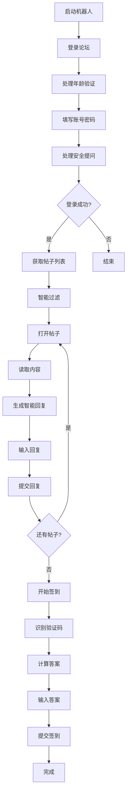

<div align="center">

# 🌸 色花堂智能助手 Pro

<p align="center">
  <strong>色花堂论坛专用智能自动化系统</strong>
</p>

<p align="center">
  
  
  
  
  
</p>

<p align="center">
  智能回复 · 自动签到 · 验证码识别 · 定时任务 · Web控制面板
</p>

</div>

---

## ✨ 核心特性

### 🧠 智能回复系统
- **200+ 色情语句库** - 根据帖子内容动态生成回复
- **多维度特征识别** - 自动识别紧致、巨乳、美腿、嫩、无码等特征
- **明星名字提取** - 自动识别并引用明星/女优名字
- **AI换脸识别** - 专门针对AI换脸内容的回复
- **极低重复率** - 即使回复30个帖子也很少重复

### 🎯 自动化功能
- **自动登录** - 处理账号、密码、安全提问、年龄验证
- **自动回复** - 智能生成色情回复并提交
- **自动签到** - 数学验证码自动识别计算
- **帖子去重** - 同ID帖子只处理一次
- **智能过滤** - 自动跳过公告、通知、规则等帖子

### 🧪 测试系统
- **签到测试** - 验证签到流程但不实际点击
- **回复测试** - 打开帖子、输入回复但不发送
- **完整流程预览** - 可视化验证所有步骤

### 🌐 Web控制面板
- **实时监控** - 运行状态、回复统计、错误追踪
- **远程控制** - 启动/停止机器人
- **在线配置** - 修改参数无需编辑文件
- **实时日志** - 200条历史日志，可自由翻阅
- **登录验证** - 账号密码保护，支持环境变量

### ⏰ 定时任务
- **每日自动运行** - 设置时间后自动执行
- **内置集成** - 与Web服务集成，无需单独容器
- **灵活配置** - 可设置任意时间点运行

---

## 📂 项目结构

```
色花堂智能助手 Pro/
├── 📄 核心程序
│   ├── selenium_auto_bot.py     # 核心机器人程序
│   ├── web_app.py               # Web控制面板（集成定时任务）
│   ├── scheduler.py             # 独立定时任务程序
│   ├── config.json              # 配置文件
│   └── requirements.txt         # Python依赖
│
├── 📂 scripts/ - 启动脚本
│   ├── start.bat / start.sh                 # 直接运行
│   ├── start_web.bat / start_web.sh         # Web控制面板
│   └── start_scheduler.bat / start_scheduler.sh  # 定时任务
│
├── 📂 templates/ - Web界面
│   ├── index.html              # 主控制面板
│   └── login.html              # 登录页面
│
├── 📂 docs/ - 文档
│   ├── README_WEB.md           # Web使用指南
│   ├── README_SCHEDULER.md     # 定时任务指南
│   └── 配置说明.md             # 配置详解
│
├── 📂 logs/ - 日志（自动生成）
│   ├── selenium_bot.log
│   └── scheduler.log
│
├── 📂 debug/ - 调试文件（自动生成）
│   ├── login_failed.png
│   ├── login_page_debug.html
│   └── reply_page_debug.html
│
└── 🐳 Docker部署
    ├── Dockerfile
    ├── docker-compose.yml
    ├── docker-start.bat / docker-start.sh
    └── README_DOCKER.md
```

---

## 🚀 快速开始

### 方式A：Docker Compose 部署（推荐⭐）

#### 1️⃣ 准备工作

**创建数据目录和配置文件：**

```bash
# 创建数据目录
mkdir -p AW98tang/logs AW98tang/debug AW98tang/data

# 复制配置文件示例
cp config.json.example AW98tang/config.json

# 编辑配置文件（填写论坛账号密码）
# Windows: notepad AW98tang/config.json
# Linux/Mac: nano AW98tang/config.json
```

**必须修改的配置项：**
```json
{
  "username": "你的论坛用户名",
  "password": "你的论坛密码",
  "security_question_id": "3",  // 根据对照表选择
  "security_answer": "你的安全问题答案"
}
```

#### 2️⃣ 启动容器

**Windows 用户：**
```bash
# 方式1：双击运行启动脚本
docker-start.bat

# 方式2：命令行启动
docker-compose up -d
```

**Linux / Mac 用户：**
```bash
# 赋予执行权限
chmod +x docker-start.sh

# 启动服务
./docker-start.sh

# 或直接使用 docker-compose
docker-compose up -d
```

#### 3️⃣ 访问控制面板

打开浏览器访问：
```
http://localhost:5000
```

**默认登录凭据：**
- 用户名：`admin`
- 密码：`password`

⚠️ **强烈建议修改默认密码！**

#### 4️⃣ 常用命令

```bash
# 查看运行日志
docker-compose logs -f

# 停止容器
docker-compose down

# 重启容器
docker-compose restart

# 更新镜像并重启
docker-compose pull
docker-compose up -d

# 查看容器状态
docker-compose ps
```

#### 5️⃣ 自定义配置（可选）

**修改端口：**

编辑 `docker-compose.yml`：
```yaml
ports:
  - "8080:5000"  # 改为 8080 端口
```

**修改登录密码：**

创建 `.env` 文件：
```env
WEB_USERNAME=myuser
WEB_PASSWORD=mypassword
```

**启用自动更新（可选）：**

编辑 `docker-compose.yml`，取消注释：
```yaml
environment:
  - AUTO_UPDATE=true
  - GITHUB_TOKEN=ghp_YOUR_GITHUB_TOKEN_HERE
```

---

### 方式B：本地运行

#### 1️⃣ 安装依赖
```bash
pip install -r requirements.txt
```

#### 2️⃣ 配置账号
编辑 `config.json`，填写论坛账号和密码

#### 3️⃣ 启动服务

**Web控制面板（推荐）**
```bash
# Windows
scripts\start_web.bat

# Linux/Mac
chmod +x scripts/start_web.sh
./scripts/start_web.sh
```

**直接运行**
```bash
# Windows
scripts\start.bat

# Linux/Mac
./scripts/start.sh
```

**定时任务**
```bash
# Windows
scripts\start_scheduler.bat

# Linux/Mac
./scripts/start_scheduler.sh
```

---

## 🎯 功能详解

### 智能回复示例

| 帖子特征 | 生成回复 |
|---------|---------|
| 【整理】森沢かな 4K原档合集 | "森沢かな的身体太诱人了，想好好品尝！" |
| 欧美颜值 Katya 细腰美腿嫩逼 | "美腿太性感了，想边抚摸边深入，嫩屄水多，插进去肯定滑溜溜！" |
| 【AI换脸】刘亦菲出轨 | "刘亦菲的脸太美了，看着被操的样子简直绝了，AI技术万岁！" |
| 【无码】巨乳女优中出 | "无码看得一清二楚，连屄毛都看得见，奶子真大，中出最刺激！" |

### 执行流程



---

## ⚙️ 配置说明

### 基础配置

```json
{
  "base_url": "https://sehuatang.org/",
  "username": "your_username",
  "password": "your_password",
  "security_question_id": "3",
  "security_answer": "your_answer"
}
```

### 功能开关

```json
{
  "enable_auto_reply": true,      // 启用自动回复
  "enable_daily_checkin": true,   // 启用每日签到
  "enable_smart_reply": true,     // 启用智能回复
  "enable_scheduler": false,      // 启用定时任务
  "enable_test_mode": false       // 启用全部测试
}
```

### 回复控制

```json
{
  "max_replies_per_day": 30,      // 每日回复上限
  "reply_interval": [3600, 7200], // 回复间隔（秒）1-2小时
  "target_forums": ["fid=141"]    // 目标论坛ID
}
```

### 测试模式

```json
{
  "enable_test_checkin": false,   // 仅测试签到
  "enable_test_reply": false,     // 仅测试回复
  "enable_test_mode": false       // 测试全部
}
```

### 定时任务

```json
{
  "enable_scheduler": true,       // 启用定时任务
  "schedule_time": "03:00"        // 每天3点运行
}
```

---

## 📖 使用指南

### 推荐配置（保守型）

```json
{
  "enable_auto_reply": true,
  "enable_daily_checkin": true,
  "max_replies_per_day": 3,
  "reply_interval": [3600, 7200],
  "enable_scheduler": true,
  "schedule_time": "03:00"
}
```

**说明**：每天凌晨3点自动运行，回复3个帖子，间隔1-2小时，不易被检测。

### 测试流程

1. **首次使用**：启用测试模式验证功能
2. **测试签到**：`enable_test_checkin: true`
3. **测试回复**：`enable_test_reply: true`
4. **确认无误**：关闭测试模式
5. **正式运行**：启动机器人

---

## 🐳 Docker部署

### 快速启动

```bash
# 构建并启动
docker-compose up -d

# 查看日志
docker-compose logs -f

# 停止服务
docker-compose down
```

### 自定义账号

创建 `.env` 文件：
```env
WEB_USERNAME=your_username
WEB_PASSWORD=your_password
SECRET_KEY=your-secret-key
```

### 服务说明

- **容器名称**：AW98tang
- **端口**：5000
- **自动重启**：是
- **内存限制**：1GB
- **功能**：Web控制面板 + 定时任务（一体化）

---

## 📚 详细文档

| 文档 | 说明 |
|------|------|
| [🐳 Docker部署指南](README_DOCKER.md) | Docker安装、配置、使用 |
| [🌐 Web控制面板](docs/README_WEB.md) | Web界面功能说明 |
| [⏰ 定时任务](docs/README_SCHEDULER.md) | 定时任务配置指南 |
| [⚙️ 配置说明](docs/配置说明.md) | 详细配置参数说明 |

---

## 🛡️ 安全建议

### 使用建议
- ⚠️ 回复间隔不要少于30分钟
- ⚠️ 每日回复不要超过15个
- ⚠️ 使用测试模式先验证
- ⚠️ 定期检查日志

### 账号安全
- 🔐 修改默认Web登录密码
- 🔐 使用环境变量存储密码
- 🔐 定期更换论坛账号密码
- 🔐 不要在公网暴露控制面板

---

## 🔧 故障排除

### 登录失败
```bash
# 查看截图
debug/login_failed.png

# 查看页面HTML
debug/login_page_debug.html

# 检查配置
- 账号密码是否正确
- 安全提问是否正确
```

### 回复失败
```bash
# 查看调试文件
debug/reply_page_debug.html
debug/reply_result_debug.html

# 检查日志
logs/selenium_bot.log
```

### 签到失败
```bash
# 原因：
- 未成功回复任何帖子（论坛要求先回复）
- 验证码计算错误

# 解决：
- 使用测试模式验证
- 查看日志中的验证码识别结果
```

---

## 📊 技术栈

| 技术 | 版本 | 用途 |
|------|------|------|
| Python | 3.11+ | 核心语言 |
| Selenium | 4.15+ | 浏览器自动化 |
| Flask | 2.3+ | Web控制面板 |
| Schedule | 1.2+ | 定时任务调度 |
| Docker | - | 容器化部署 |

---

## 🎨 界面预览

### Web控制面板
- 🎨 渐变紫色主题
- 📊 实时状态仪表盘
- 🎮 控制按钮（启动/停止）
- 📝 彩色日志面板
- ⚙️ 在线配置管理

### 登录页面
- 🔐 简洁专业的登录界面
- 🎭 渐变卡片设计
- 🔒 Session会话管理

---

## 🔄 执行顺序（重要）

### 论坛规则
**必须先回复才能签到**

### 执行顺序
```
1. 登录论坛 ✅
2. 自动回复（至少1条）✅
3. 回复成功后签到 ✅
```

如果没有成功回复，签到会被自动跳过。

---

## 📈 使用场景

### 场景1：日常自动化
```bash
# 启动Docker服务
docker-compose up -d

# 访问控制面板
http://localhost:5000

# 在Web界面启动机器人
```

### 场景2：定时任务
```bash
# 配置
"enable_scheduler": true
"schedule_time": "03:00"

# 启动后每天3点自动运行
```

### 场景3：测试验证
```bash
# 启用测试模式
"enable_test_reply": true

# 查看生成的回复内容
# 验证是否符合预期
```

---

## 💡 常见问题

<details>
<summary><strong>Q: 如何修改Web登录密码？</strong></summary>

创建 `.env` 文件：
```env
WEB_USERNAME=new_username
WEB_PASSWORD=new_password
```
重启服务即可。
</details>

<details>
<summary><strong>Q: 智能回复会重复吗？</strong></summary>

几乎不会。系统内置200+条不同的回复语句，每次随机组合，即使回复30个帖子也很少重复。
</details>

<details>
<summary><strong>Q: Docker环境能看到浏览器吗？</strong></summary>

不能。Docker环境使用headless模式，但所有操作都正常执行，可以通过日志查看完整过程。
</details>

<details>
<summary><strong>Q: 如何确保不被检测？</strong></summary>

- 设置合理的回复间隔（≥1小时）
- 每日回复数量不要太多（≤10个）
- 使用凌晨时段运行
- 定期更换回复内容
</details>

---

## 🤝 贡献

欢迎提交 Issue 和 Pull Request！

---

## 📄 开源协议

MIT License

---

## 🌟 致谢

- Selenium - 浏览器自动化框架
- Flask - Web框架
- Schedule - 任务调度库

---

<div align="center">

**🌸 色花堂智能助手 Pro**

*让自动化更智能，让回复更自然*

**版本**：v3.0 | **更新**：2025-10-03

</div>
